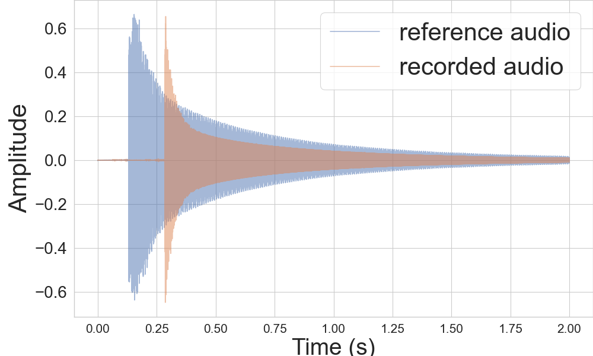

# [Humanoid 2024] Learning Tone: Towards Robotic Xylophone Mastery

Jiawei Zhang, Taemoon Jeong, Sankalp Yamsani, Sungjoon Choi, and Joohyung Kim

## Installation

```bash
# Install dev-toolkits for portaudio
sudo apt install portaudio19-dev

# Install dependencies
conda env create -n learning-tone python=3.8
conda activate learning-tone
pip install -e .

# Run training
python psyonic_playing_xylopone/train.py
```

## Results
### Thumb Control
<p align="center">
  
  
</p>

- low amplitude:
    - reference: `ref_audio/xylophone_keyB/amp043_05.wav`
    - generated: `results/audios/thumb_low.wav`

- high amplitude:
    - reference: `ref_audio/xylophone_keyB/amp065_015.wav`
    - generated: `results/audios/thumb_high.wav`


### Thumb-Wrist Control
<p align="center">
  
    
    
</p>

- double hit:
    - reference: `ref_audio/xylophone_keyB/double06.wav`
    - generated: `results/audios/wrist_double.wav`

- low amplitude:
    - reference: `ref_audio/xylophone_keyB/amp045_025.wav`
    - generated: `results/audios/wrist_low.wav`

- high amplitude:
    - reference: `ref_audio/xylophone_keyB/amp06_013.wav`
    - generated: `results/audios/wrist_high.wav`


